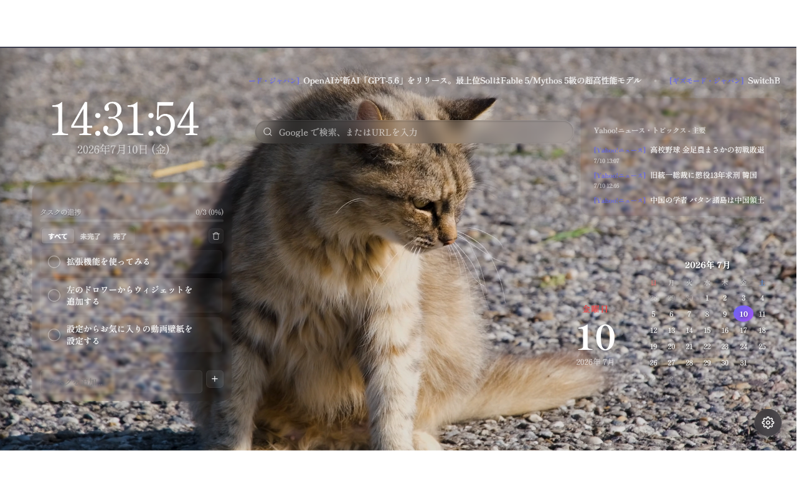
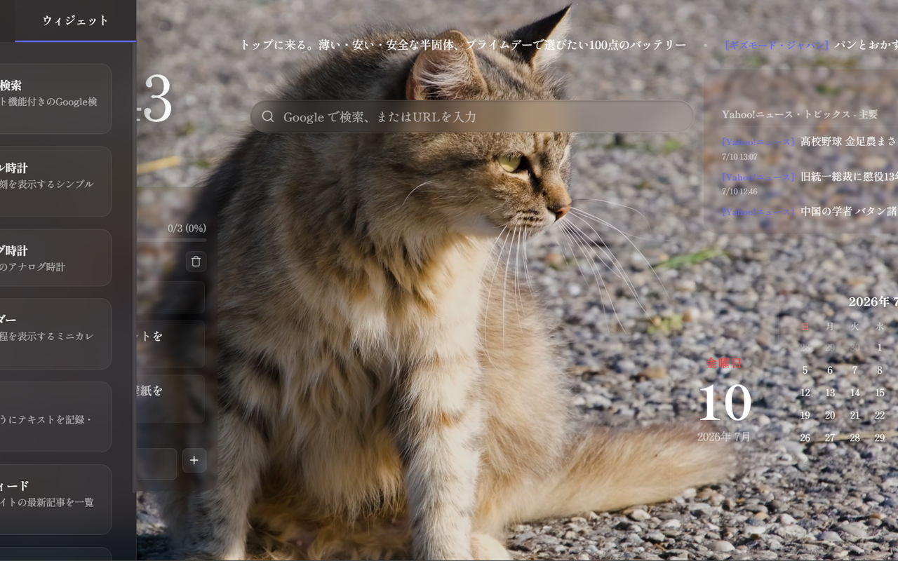
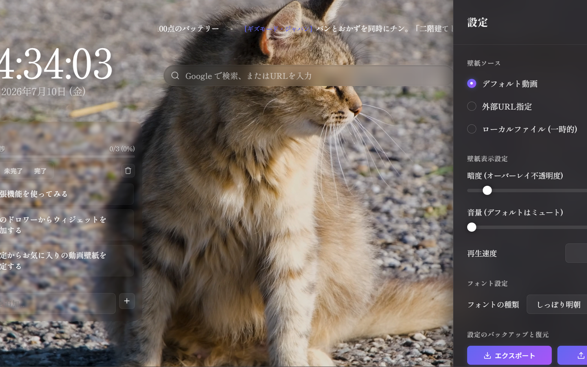

# 窓辺 (Madobe) - 動画背景とウィジェットの軽量新規タブ

Chromeの新規タブ（ホーム画面）を、お気に入りの動画背景と便利なウィジェットで美しく、そして実用的にカスタマイズできる Manifest V3 対応の軽量Chrome拡張機能です。

## スクリーンショット

| メイン画面（ウィジェット配置状態） |
| :---: |
|  |

| 左側スライドドロワー | 設定パネル（グラスモルフィズム） |
| :---: | :---: |
|  |  |

---

## 主な特徴

- **滑らかな動画背景**
  - お好みのローカル動画ファイル（MP4 / WebM等、30MB以下）をアップロードして背景に設定可能。IndexedDBに安全に保存され、ブラウザ再起動後も自動で再生されます。
  - 外部の動画直リンク（HTTPS）を背景に指定することも可能です。
- **徹底した軽量・省電力設計**
  - **非アクティブ時の自動一時停止**: タブがバックグラウンドに回った際やウィンドウが最小化された時は、動画再生を自動で完全に停止し、CPU/GPUおよびメモリの消費を抑えます。
  - **Vanilla実装**: フレームワークを使用せず、素のHTML/CSS/JavaScriptのみで構築されているため、起動が極めて高速です。
  - **GPUアクセラレーション**: 描画負荷を抑えるCSS記述により、スムーズな描画と省電力を両立しています。
- **自由度の高いウィジェットシステム**
  - 画面を「横48マス × 縦24マス」の細かな仮想グリッドに分割。各ウィジェットをドラッグ＆ドロップで配置・移動・リサイズ（スナップ整列）できます。
  - **ポジション・スワップ & 衝突回避**: ウィジェットを移動させると、重なった他のウィジェットが滑らかなアニメーションで自動的に退避・スワップします。
  - **Wiggleエフェクト（編集モード）**: ウィジェットを長押し（ロングプレス）すると編集モードに移行し、iOSのようにアイコンがプルプルと震えて直感的にレイアウトを調整できます。
  - **現在提供中のウィジェット**:
    - **Google検索**: サジェスト（予測）や履歴候補が移動先に追従して直下に表示される高機能検索バー。
    - **デジタル時計**: 時刻と日付を表示する美しい時計。
    - **アナログ時計**: CSSデザインで針が回転する円形時計。
    - **カレンダー**: 今月の日付グリッドを表示し、当日をハイライト。
    - **メモ帳 (Todo)**: テキストを自動保存する付箋。入力文字量に合わせて高さが動的にオートフィットします。
    - **ToDoリスト**: 完了チェック、グラデーション進捗バー、ステータスフィルター（すべて/未完了/完了）を備えた本格的なタスク管理。
    - **RSSフィード**: 複数URLのフィードを日付順にマージソートして表示。等速スクロール（速度調整付き）およびCORS制限をバイパスする一括権限申請に対応。
- **ショートカットドロワー**
  - 通常は画面の左端に隠れており、マウスホバーで滑らかに出現するグラスモルフィズム（すりガラス調）のドロワー。
  - よく使うサイトへのクイックリンク（ショートカット）を登録・管理（CRUD）できます。
- **高度なカスタマイズと安全設計**
  - **フォントカスタマイズ**: 厳選された日本語・英語の美しいフォントプリセットに加え、Google Fontsから任意のフォントを動的インポートして適用可能。
  - **壁紙コントロール**: 不透明度（暗色オーバーレイによる文字視認性確保）、音量、再生速度（0.5x〜2.0x、一時停止）を細かく調整可能。
  - **バックアップと復元**: 配置したウィジェットやショートカット、設定データをJSONファイルとしてローカルに保存・復元できます。
  - **安全リセット**: 誤操作による全消去を防ぐため、確認モーダルに「リセット」と手入力しなければ実行できない安全装置付き。

---

## インストール方法（開発者モードでのロード）

本拡張機能は、Chromeウェブストアに登録する前の開発段階でも、以下の手順でローカル環境に直接読み込ませることができます。

1. 本リポジトリをローカルPCにクローンまたはダウンロードします。
   ```bash
   git clone https://github.com/YourUsername/chrome-wallpaper.git
   ```
2. Google Chrome を開き、アドレスバーに `chrome://extensions/` と入力して拡張機能管理画面を開きます。
3. 画面右上の **「デベロッパー モード」** のトグルスイッチを **オン** にします。
4. 画面左上に表示される **「パッケージ化されていない拡張機能を読み込む」** ボタンをクリックします。
5. クローンしたフォルダ（`manifest.json` が存在するフォルダ）を選択して読み込みます。
6. 新しいタブを開くと、本拡張機能「窓辺」が適用されます。

---

## パッケージビルド方法

配布用パッケージ（ZIPファイル）を作成するための Python スクリプトが同梱されています。開発用の不要ファイル（ドキュメントやスクショ、Git管理ファイルなど）を除外し、公開に必要なファイルのみを自動でZIP圧縮します。

### 実行方法

1. ターミナルでリポジトリのルートディレクトリに移動します。
2. 以下のコマンドを実行します。
   ```bash
   python build.py
   ```
3. ビルドに成功すると、ルート配下に `dist/madobe_v[バージョン].zip` が生成されます。

---

## 主要なディレクトリ構成

```text
madobe/
├── manifest.json         # 拡張機能のマニフェストファイル
├── newtab.html           # 新規タブのメインHTML
├── newtab.js             # メインロジック (ES Modules エントリーポイント)
├── js/                   # JavaScript 機能モジュール群
│   ├── state.js          # 状態管理・DOMキャッシュ
│   ├── storage.js        # IndexedDB/storage.local 制御
│   ├── physics.js        # ドラッグ＆ドロップおよびスワップ/衝突回避物理演算
│   ├── widgets.js        # 各ウィジェットのレンダリング・制御
│   ├── shortcuts.js      # クイックリンクドロワー制御
│   └── ...
├── css/                  # スタイルシート群 (Vanilla CSS)
│   ├── variables.css     # CSSデザイン変数・共通定義
│   ├── layout.css        # 全体レイアウト
│   ├── settings.css      # 設定パネルのスタイル
│   ├── widgets.css       # ウィジェット共通/個別のスタイル
│   └── ...
├── assets/               # アイコンおよびデフォルト動画
│   ├── icon16.png / icon48.png / icon128.png
│   └── default_bg.mp4    # デフォルトの猫ループ動画 (約18.6MB)
├── build.py              # 配布用ZIP生成ビルドスクリプト
└── screenshots/          # プロモーション・説明用画像
```

---

## プライバシーとセキュリティについて

- **完全ローカル完結型**: 本拡張機能は、ユーザーがアップロードした動画や設定、ToDoリストの内容、RSSフィードのURLなどのいかなるデータも、外部サーバーに送信することはありません。
- **データ保存場所**:
  - 設定データ・ショートカットリンク: Chrome標準の `chrome.storage.local`
  - ローカル動画ファイル: ブラウザが提供する安全なサンドボックス領域内の `IndexedDB`

---

## ライセンス

[MIT License](LICENSE)
